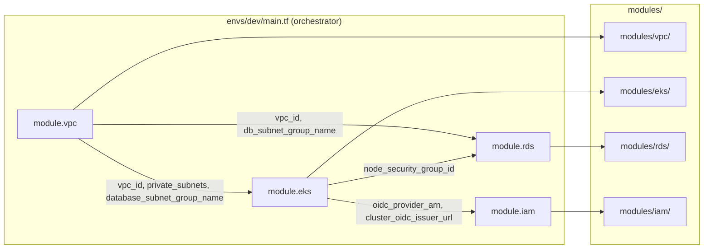

# Terraform Modules — Step-by-Step Guide for Beginners

This guide teaches how Terraform modules work using the **zen-pharma** infrastructure in this repository. By the end, you should be able to answer:

- What is a module?
- Why do modules need **inputs** (variables)?
- Why do modules need **outputs**?
- How do you **write** a module?
- How do you **call** a module from `main.tf`?

You can copy sections from this document and walk learners through them in order.

---

## Table of Contents

1. [What Is a Module?](#1-what-is-a-module)
2. [Module Folder Structure](#2-module-folder-structure)
3. [The Big Picture in This Repo](#3-the-big-picture-in-this-repo)
4. [Step-by-Step: Build a VPC Module](#4-step-by-step-build-a-vpc-module)
5. [Step-by-Step: Build an EKS Module](#5-step-by-step-build-an-eks-module)
6. [Step-by-Step: Call Modules from main.tf](#6-step-by-step-call-modules-from-maintf)
7. [How Modules Connect to Each Other](#7-how-modules-connect-to-each-other)
8. [Mental Model Checklist](#8-mental-model-checklist)
9. [Try It Yourself (Exercise)](#9-try-it-yourself-exercise)
10. [Common Mistakes Beginners Make](#10-common-mistakes-beginners-make)

---

## 1. What Is a Module?

Think of a Terraform module like a **function in programming**:

| Programming | Terraform |
|---|---|
| Function name | Module name (`module "vpc"`) |
| Function parameters | Input variables (`variables.tf`) |
| Function body | Resources (`main.tf`) |
| Return value | Outputs (`outputs.tf`) |
| Calling the function | `module "vpc" { ... }` block in `main.tf` |

**Without modules**, you would copy-paste the same VPC code into `dev`, `qa`, and `prod`. Change one thing, update three places. Easy to make mistakes.

**With modules**, you write the VPC logic once in `modules/vpc/` and call it from each environment with different values:

```
modules/vpc/          ← write once (the "function definition")
envs/dev/main.tf      ← call with dev values
envs/qa/main.tf       ← call with qa values
envs/prod/main.tf     ← call with prod values
```

A module is just a **folder of `.tf` files**. Terraform treats that folder as a reusable unit.

---

## 2. Module Folder Structure

Every module in this repo follows the same three-file pattern:

```
modules/vpc/
├── main.tf         ← creates AWS resources
├── variables.tf    ← declares what the caller must (or can) pass in
└── outputs.tf      ← declares what the caller gets back
```

| File | Purpose | Analogy |
|---|---|---|
| `variables.tf` | Inputs the module accepts | Function parameters |
| `main.tf` | Resources the module creates | Function body |
| `outputs.tf` | Values the module exposes to the caller | Return values |

Optional files you may see in other projects: `versions.tf` (provider constraints), `README.md` (documentation). This repo keeps it minimal.

---

## 3. The Big Picture in This Repo

In zen-pharma, the **environment** (`envs/dev/`) is the orchestrator. It does not create VPC or EKS resources directly. It **calls modules** and wires them together.

```
envs/dev/main.tf
    │
    ├── module "vpc"     ──► modules/vpc/
    │       outputs: vpc_id, private_subnets, database_subnet_group_name, ...
    │
    ├── module "eks"     ──► modules/eks/
    │       needs: vpc_id, subnet_ids  (from vpc outputs)
    │       outputs: cluster_name, oidc_provider_arn, node_security_group_id, ...
    │
    ├── module "rds"     ──► modules/rds/
    │       needs: vpc_id, db_subnet_group_name (from vpc)
    │                eks_node_security_group_id (from eks)
    │
    └── module "iam"     ──► modules/iam/
            needs: oidc_provider_arn (from eks)
```

**Key idea:** Modules do not talk to each other directly. The **caller** (`envs/dev/main.tf`) passes outputs from one module as inputs to the next. That is how dependencies are expressed.

---

## 4. Step-by-Step: Build a VPC Module

We will build `modules/vpc/` the same way this repository does.

### Step 4.1 — Create the module folder

```bash
mkdir -p modules/vpc
touch modules/vpc/variables.tf
touch modules/vpc/main.tf
touch modules/vpc/outputs.tf
```

### Step 4.2 — Define inputs (`variables.tf`)

**Why inputs?** A module must not hardcode values that change per environment. Dev might use `10.0.0.0/16`; prod might use `10.1.0.0/16`. Inputs let the **caller** decide; the module only defines **what** it needs.

Write `modules/vpc/variables.tf`:

```hcl
variable "project" {
  description = "Project name"
  type        = string
}

variable "env" {
  description = "Environment name (dev, qa, prod)"
  type        = string
}

variable "region" {
  description = "AWS region"
  type        = string
  default     = "us-east-1"
}

variable "vpc_cidr" {
  description = "CIDR block for the VPC"
  type        = string
  default     = "10.0.0.0/16"
}

variable "public_subnet_cidrs" {
  description = "CIDR blocks for public subnets"
  type        = list(string)
}

variable "private_subnet_cidrs" {
  description = "CIDR blocks for private subnets (EKS)"
  type        = list(string)
}

variable "database_subnet_cidrs" {
  description = "CIDR blocks for database subnets (RDS)"
  type        = list(string)
}
```

**Explain to learners — why each input exists:**

| Variable | Why the module needs it |
|---|---|
| `project`, `env` | Naming and tagging resources consistently (`pharma-dev-vpc`) |
| `region` | Subnet AZs are built from region (`us-east-1a`, `us-east-1b`) |
| `vpc_cidr` | Network size differs by environment |
| `public_subnet_cidrs` | Caller chooses IP ranges; module should not assume them |
| `private_subnet_cidrs` | EKS nodes live here; sizes vary by env |
| `database_subnet_cidrs` | RDS lives here; isolated from EKS subnets |

**Required vs optional:** Variables without `default` are **required** — the caller must pass them. Variables with `default` are **optional**.

### Step 4.3 — Write the module body (`main.tf`)

**Why `main.tf`?** This is where the module actually creates infrastructure. In this repo, we wrap the community [terraform-aws-modules/vpc](https://registry.terraform.io/modules/terraform-aws-modules/vpc/aws) module instead of writing every subnet and route table by hand. That is a common real-world pattern: **your module adds project-specific defaults; the community module does the heavy lifting.**

Write `modules/vpc/main.tf`:

```hcl
module "vpc" {
  source  = "terraform-aws-modules/vpc/aws"
  version = "~> 6.0"

  name = "${var.project}-${var.env}-vpc"
  cidr = var.vpc_cidr

  azs              = ["${var.region}a", "${var.region}b"]
  public_subnets   = var.public_subnet_cidrs
  private_subnets  = var.private_subnet_cidrs
  database_subnets = var.database_subnet_cidrs

  enable_nat_gateway           = true
  single_nat_gateway           = true
  enable_dns_hostnames         = true
  enable_dns_support           = true
  create_database_subnet_group = true

  public_subnet_tags = {
    "kubernetes.io/role/elb" = "1"
  }

  private_subnet_tags = {
    "kubernetes.io/role/internal-elb"                         = "1"
    "kubernetes.io/cluster/${var.project}-${var.env}-cluster" = "owned"
  }

  tags = {
    Project = var.project
    Env     = var.env
  }
}
```

**Explain to learners:**

- `source` points to the **inner** module (Terraform Registry). Our `modules/vpc/` is a **wrapper** that sets zen-pharma-specific tags and subnet layout.
- `var.project`, `var.env`, etc. come from the caller — the module uses inputs, not hardcoded `"pharma"`.
- Subnet tags with `kubernetes.io/...` are required so AWS Load Balancers and EKS know which subnets to use. This belongs in the module so every environment gets it right.

### Step 4.4 — Define outputs (`outputs.tf`)

**Why outputs?** Other modules (EKS, RDS) need the VPC ID and subnet IDs. They cannot read inside `modules/vpc/` directly. Outputs are the module's **public API** — the only values callers are allowed to use.

Write `modules/vpc/outputs.tf`:

```hcl
output "vpc_id" {
  description = "ID of the VPC"
  value       = module.vpc.vpc_id
}

output "public_subnets" {
  description = "List of public subnet IDs"
  value       = module.vpc.public_subnets
}

output "private_subnets" {
  description = "List of private subnet IDs"
  value       = module.vpc.private_subnets
}

output "database_subnets" {
  description = "List of database subnet IDs"
  value       = module.vpc.database_subnets
}

output "database_subnet_group_name" {
  description = "Name of the database subnet group"
  value       = module.vpc.database_subnet_group_name
}
```

**Explain to learners — why each output exists:**

| Output | Who consumes it | Why |
|---|---|---|
| `vpc_id` | EKS, RDS security groups | Resources must be placed **inside** this VPC |
| `private_subnets` | EKS | Worker nodes run in private subnets |
| `public_subnets` | (future) Load balancers, NAT | Public-facing network paths |
| `database_subnets` | RDS | Database isolated in its own subnets |
| `database_subnet_group_name` | RDS module | RDS requires a subnet group name |

**Rule of thumb:** Export only what downstream modules need. Do not export everything the inner module exposes — keep the interface small and stable.

---

## 5. Step-by-Step: Build an EKS Module

EKS **depends on VPC**. The EKS module does not create a VPC; it receives `vpc_id` and `subnet_ids` as inputs from the VPC module's outputs.

### Step 5.1 — Create the module folder

```bash
mkdir -p modules/eks
touch modules/eks/variables.tf
touch modules/eks/main.tf
touch modules/eks/outputs.tf
```

### Step 5.2 — Define inputs (`variables.tf`)

```hcl
variable "project" {
  description = "Project name"
  type        = string
}

variable "env" {
  description = "Environment name (dev, qa, prod)"
  type        = string
}

variable "vpc_id" {
  description = "VPC ID for the EKS cluster"
  type        = string
}

variable "subnet_ids" {
  description = "Subnet IDs for EKS nodes"
  type        = list(string)
}

variable "kubernetes_version" {
  description = "Kubernetes version for the EKS cluster"
  type        = string
  default     = "1.35"
}

variable "instance_types" {
  description = "Instance types for the node group"
  type        = list(string)
  default     = ["t3.medium"]
}

variable "desired_size" {
  description = "Desired number of worker nodes"
  type        = number
  default     = 2
}

variable "min_size" {
  description = "Minimum number of worker nodes"
  type        = number
  default     = 1
}

variable "max_size" {
  description = "Maximum number of worker nodes"
  type        = number
  default     = 3
}
```

**Explain to learners — why these inputs:**

| Variable | Why |
|---|---|
| `vpc_id`, `subnet_ids` | EKS must know **where** to run. These come from the VPC module — EKS cannot guess them. |
| `kubernetes_version` | Dev may run a newer version for testing; prod may lag for stability. |
| `instance_types`, `min_size`, `max_size`, `desired_size` | **Sizing** differs by environment. Dev uses small nodes; prod uses larger ones. |

Notice: `vpc_id` and `subnet_ids` have **no default**. The caller **must** provide them. That forces the correct order: VPC first, then EKS.

### Step 5.3 — Write the module body (`main.tf`)

```hcl
module "eks" {
  source  = "terraform-aws-modules/eks/aws"
  version = "~> 21.0"

  name               = "${var.project}-${var.env}-cluster"
  kubernetes_version = var.kubernetes_version

  vpc_id     = var.vpc_id
  subnet_ids = var.subnet_ids

  endpoint_private_access = true
  endpoint_public_access  = true

  enable_irsa                              = true
  enable_cluster_creator_admin_permissions = true

  addons = {
    vpc-cni = {
      most_recent    = true
      before_compute = true
    }
    kube-proxy             = { most_recent = true }
    coredns                = { most_recent = true }
    eks-pod-identity-agent = { most_recent = true }
  }

  eks_managed_node_groups = {
    main = {
      instance_types = var.instance_types
      min_size       = var.min_size
      max_size       = var.max_size
      desired_size   = var.desired_size
    }
  }

  tags = {
    Project = var.project
    Env     = var.env
  }
}
```

**Explain to learners:**

- `vpc_id` and `subnet_ids` are **passed through** from the caller — the EKS module wires them into the community EKS module.
- `enable_irsa = true` enables IAM Roles for Service Accounts (pods get AWS permissions without static keys). The IAM module later needs the OIDC provider that EKS creates.
- Node group sizing uses variables so `envs/dev/main.tf` can set `desired_size = 4` without changing the module code.

### Step 5.4 — Define outputs (`outputs.tf`)

```hcl
output "cluster_name" {
  description = "Name of the EKS cluster"
  value       = module.eks.cluster_name
}

output "cluster_endpoint" {
  description = "Endpoint for the EKS cluster API server"
  value       = module.eks.cluster_endpoint
}

output "cluster_certificate_authority_data" {
  description = "Base64 encoded certificate data for the cluster"
  value       = module.eks.cluster_certificate_authority_data
}

output "oidc_provider_arn" {
  description = "ARN of the OIDC Provider for IRSA"
  value       = module.eks.oidc_provider_arn
}

output "cluster_oidc_issuer_url" {
  description = "URL of the OIDC Provider for IRSA"
  value       = module.eks.cluster_oidc_issuer_url
}

output "node_security_group_id" {
  description = "Security group ID of the EKS node group"
  value       = module.eks.node_security_group_id
}

output "cluster_security_group_id" {
  description = "Security group ID of the EKS cluster"
  value       = module.eks.cluster_security_group_id
}
```

**Explain to learners — who uses each output:**

| Output | Consumer | Why |
|---|---|---|
| `cluster_name` | Humans, CI/CD, `kubectl` | Identify the cluster |
| `cluster_endpoint`, `cluster_certificate_authority_data` | Kubernetes provider, kubeconfig | Connect to the API server |
| `oidc_provider_arn`, `cluster_oidc_issuer_url` | `modules/iam/` | Trust policies for IRSA roles (ArgoCD, External Secrets, etc.) |
| `node_security_group_id` | `modules/rds/` | Allow PostgreSQL traffic **only** from EKS nodes |
| `cluster_security_group_id` | Other networking rules | Control plane ↔ node communication |

This is the **output → input chain**: EKS outputs flow into IAM and RDS modules in `envs/dev/main.tf`.

---

## 6. Step-by-Step: Call Modules from main.tf

The **root module** (or environment) is `envs/dev/main.tf`. It does not define `aws_vpc` or `aws_eks_cluster` directly. It **calls** your modules and passes values.

### Step 6.1 — Set shared locals

```hcl
locals {
  project = "pharma"
  env     = "dev"
  region  = "us-east-1"
}
```

`locals` are values used only in this environment file — not passed into modules unless you explicitly pass them.

### Step 6.2 — Call the VPC module

```hcl
module "vpc" {
  source = "../../modules/vpc"

  project               = local.project
  env                   = local.env
  region                = local.region
  vpc_cidr              = "10.0.0.0/16"
  public_subnet_cidrs   = ["10.0.1.0/24", "10.0.2.0/24"]
  private_subnet_cidrs  = ["10.0.3.0/24", "10.0.4.0/24"]
  database_subnet_cidrs = ["10.0.5.0/24", "10.0.6.0/24"]
}
```

**Explain each part:**

| Line | Meaning |
|---|---|
| `module "vpc"` | Name of this module instance in **this** state file. Referenced as `module.vpc.*` |
| `source = "../../modules/vpc"` | Path to the module folder (relative to `envs/dev/`) |
| `project = local.project` | Passing an **input** to the module |
| `vpc_cidr = "10.0.0.0/16"` | Environment-specific value — dev's network layout |

**`source` paths:**

- Local module: `source = "../../modules/vpc"`
- Terraform Registry: `source = "terraform-aws-modules/vpc/aws"` (used **inside** `modules/vpc/main.tf`)

### Step 6.3 — Call the EKS module (using VPC outputs)

```hcl
module "eks" {
  source = "../../modules/eks"

  project            = local.project
  env                = local.env
  vpc_id             = module.vpc.vpc_id
  subnet_ids         = module.vpc.private_subnets
  kubernetes_version = "1.35"
  instance_types     = ["t3.small"]
  min_size           = 1
  max_size           = 5
  desired_size       = 4
}
```

**This is the most important line for learners:**

```hcl
vpc_id     = module.vpc.vpc_id
subnet_ids = module.vpc.private_subnets
```

Read it as: *"Take the VPC ID that the VPC module created and pass it into the EKS module."*

Syntax: `module.<module_name>.<output_name>`

Terraform automatically understands **order**: VPC must be created before EKS because EKS references VPC outputs.

### Step 6.4 — Expose environment-level outputs (optional)

In `envs/dev/output.tf`, you can re-export module outputs for humans and CI:

```hcl
output "eks_cluster_name" {
  description = "EKS cluster name"
  value       = module.eks.cluster_name
}
```

Environment outputs are what you see after `terraform apply` — they can aggregate values from several modules.

---

## 7. How Modules Connect to Each Other



**Real wiring from this repo's `envs/dev/main.tf`:**

```hcl
# EKS uses VPC outputs
module "eks" {
  vpc_id     = module.vpc.vpc_id
  subnet_ids = module.vpc.private_subnets
  ...
}

# RDS uses VPC + EKS outputs
module "rds" {
  vpc_id                     = module.vpc.vpc_id
  db_subnet_group_name       = module.vpc.database_subnet_group_name
  eks_node_security_group_id = module.eks.node_security_group_id
  ...
}

# IAM uses EKS outputs
module "iam" {
  oidc_provider_arn = module.eks.oidc_provider_arn
  oidc_provider_url = module.eks.cluster_oidc_issuer_url
  ...
}
```

**Teaching point:** Modules stay **loosely coupled**. The VPC module does not import the EKS module. Only `main.tf` knows the full graph. That makes modules reusable and testable in isolation.

---

## 8. Mental Model Checklist

When writing or reviewing a module, ask:

### Inputs (`variables.tf`)

- [ ] What values **change** between dev / qa / prod? → Those should be variables.
- [ ] What values are **always the same** for this project? → Can stay hardcoded in `main.tf`.
- [ ] What does a **downstream module** need to pass in? → Must be a variable (e.g. `vpc_id` for EKS).
- [ ] Did I add a `description` and `type` for every variable? → Helps the next developer.

### Outputs (`outputs.tf`)

- [ ] What does **another module** need from this module? → Must be an output.
- [ ] What would a **human** need after apply? → Consider environment-level outputs.
- [ ] Am I exporting **too much**? → Prefer a small, stable interface.

### Calling the module (`main.tf`)

- [ ] Is `source` pointing to the correct path?
- [ ] Are all **required** variables passed?
- [ ] Are outputs referenced as `module.<name>.<output>`?

---

## 9. Try It Yourself (Exercise)

Have learners do this in a branch (do not apply to shared AWS accounts without approval):

1. Open `envs/dev/main.tf` and find `module "vpc"` and `module "eks"`.
2. Trace one connection: find `module.vpc.vpc_id` in the EKS block. Open `modules/vpc/outputs.tf` and find where `vpc_id` is defined.
3. Change `desired_size` for EKS from `4` to `2`. Run `terraform plan` and confirm only the node group changes.
4. **Stretch:** Add a new optional variable `enable_nat_gateway` to `modules/vpc/variables.tf` (default `true`), pass it through to the inner VPC module, and call it from `envs/dev/main.tf`.

Discussion questions:

- What breaks if you remove `output "vpc_id"` from the VPC module?
- What breaks if you hardcode `vpc_id` inside the EKS module instead of using a variable?
- Why is `subnet_ids = module.vpc.private_subnets` and not `public_subnets`?

**Answer to the last question:** EKS worker nodes should run in **private** subnets (no direct internet exposure). Public subnets are for load balancers and NAT gateways.

---

## 10. Common Mistakes Beginners Make

| Mistake | What happens | Fix |
|---|---|---|
| Wrong `source` path | `Module not found` error | Count `../` from `envs/dev/` to `modules/vpc/` |
| Forgot a required variable | `Required attribute not set` | Pass every variable without a `default` |
| Used `output` name that does not exist | `Unsupported attribute` | Match exact name in `outputs.tf` |
| Referenced `module.eks.vpc_id` | Error — EKS module has no such output | Only use outputs declared in that module's `outputs.tf` |
| Put secrets in module defaults | Passwords in Git history | Pass secrets from CI (`-var`) or Secrets Manager, never hardcode |
| Circular dependencies | Terraform cannot plan | Module A output → Module B input → Module A input. Break the cycle in design. |

---

## Quick Reference Card

```
┌─────────────────────────────────────────────────────────────────┐
│  MODULE ANATOMY                                                 │
├─────────────────────────────────────────────────────────────────┤
│  variables.tf  →  WHAT the caller passes IN                     │
│  main.tf       →  WHAT the module CREATES                       │
│  outputs.tf    →  WHAT the caller gets OUT                      │
└─────────────────────────────────────────────────────────────────┘

┌─────────────────────────────────────────────────────────────────┐
│  CALL A MODULE                                                  │
├─────────────────────────────────────────────────────────────────┤
│  module "vpc" {                                                 │
│    source = "../../modules/vpc"                                 │
│    project = "pharma"        # input                            │
│  }                                                              │
└─────────────────────────────────────────────────────────────────┘

┌─────────────────────────────────────────────────────────────────┐
│  USE AN OUTPUT                                                  │
├─────────────────────────────────────────────────────────────────┤
│  module.vpc.vpc_id                                              │
│  └── module name ──┘ └── output name ──┘                        │
└─────────────────────────────────────────────────────────────────┘
```

---

## Where to Look in This Repository

| Topic | File |
|---|---|
| VPC module inputs | `modules/vpc/variables.tf` |
| VPC module resources | `modules/vpc/main.tf` |
| VPC module outputs | `modules/vpc/outputs.tf` |
| EKS module inputs | `modules/eks/variables.tf` |
| EKS module resources | `modules/eks/main.tf` |
| EKS module outputs | `modules/eks/outputs.tf` |
| Calling all modules | `envs/dev/main.tf` |
| Environment outputs | `envs/dev/output.tf` |

---

*This guide is part of the zen-pharma infra learning path. For hands-on step-by-step labs (create each module in `modules/` and wire from `envs/dev/main.tf`), start with the [Build It Yourself Lab](lab/README.md).*
